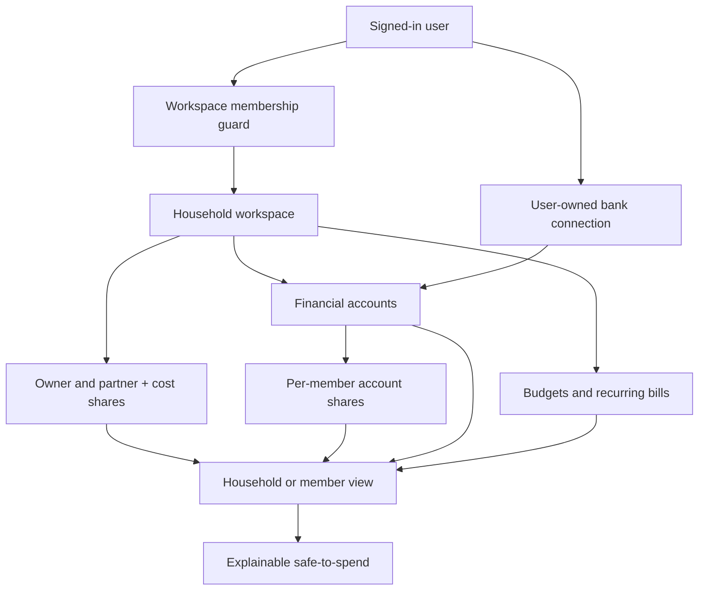

# feat: Add shared household finances

## Overview

Turn the existing one-user `BudgetWorkspace` into a secure two-person household workspace. Each person keeps a separate Wollie login, can connect only their own bank credentials, and can view the household plan through household or member ownership lenses. The slice includes invitations, workspace membership, mine/yours/joint account allocation, a configurable household cost split, personal and household safe-to-spend, visible sync freshness, and preservation of import idempotency.

## Problem Frame

The competitor research identified shared household accounting as a meaningful EU-market gap. Wollie's current schema and authorization assume `BudgetWorkspace.userId` is the only person allowed to read or mutate finance data. A cosmetic partner label would not solve collaboration or access control. The implementation must introduce an explicit membership boundary without weakening protection around financial data or bank credentials (see origin: `docs/brainstorms/2026-07-15-shared-household-finances-brainstorm.md`).

## Requirements Trace

- R1. An owner can create, email, revoke, and copy a single-use invitation addressed to a partner's email.
- R2. A signed-in partner can accept a valid unexpired invitation and access the shared workspace with a separate login.
- R3. Every finance query and mutation authorizes against workspace membership; owner-only and connection-owner-only actions remain enforced.
- R4. Accounts can be assigned 100% to either member or split jointly with percentages totaling 100%.
- R5. The household has a configurable member cost split totaling 100% for unassigned shared budgets and recurring bills.
- R6. The dashboard supports Household, Mine, and partner views and calculates an explainable safe-to-spend value for each.
- R7. Every connected account shows last-sync freshness and connection health.
- R8. New and existing imported accounts receive ownership records without weakening transaction idempotency.
- R9. Existing workspaces and accounts migrate safely to one owner member with 100% ownership.
- R10. The UI remains calm, accessible, responsive, and consistent with Wollie's existing application design.

## Scope Boundaries

- Two active members per live workspace; larger households and read-only roles are deferred.
- Invitation links are sent through the existing account-email service and remain copyable in-app as a fallback.
- A partner cannot silently merge an existing funded workspace into another household. Acceptance rejects a conflicting non-empty workspace.
- Weekly reviews, sinking funds, public bank coverage, public service status, and full backup/restore are separate follow-up work.
- Bank credentials remain owned by the user who connected them and are never exposed to the other member.

## Context & Research

### Relevant Code and Patterns

- `prisma/schema.prisma` currently uses `BudgetWorkspace.userId` as the ownership boundary and already stores `BankConnection.userId`, `FinancialAccount.lastSyncedAt`, `BankConnection.status`, and transaction uniqueness by account/provider identifier.
- `src/server/session.server.ts` is the single Better Auth session accessor.
- `src/server/finance.ts` contains all finance reads and mutations and must stop filtering only by workspace owner.
- `src/server/bank-sync.ts` and `src/server/enable-banking-sync.ts` already persist provider data transactionally and keep credentials server-only.
- `src/routes/app/index.tsx` recomputes the dashboard summary client-side from loader data; this is the existing seam for switching household views.
- `src/routes/app/accounts.tsx` already surfaces last-sync text and provider status and is the natural home for ownership controls.
- Existing UI uses Tailwind mobile-first breakpoints, neutral bordered surfaces, compact type, and minimum-height actions.

### Institutional Learnings

- `docs/plans/2026-07-13-bank-sync-budgeting-app-plan.md` requires strict ownership checks, auditable sync history, and idempotent imports from the first finance implementation.
- `docs/legal/compliance-workbook.md` treats financial data as highly personal and requires access controls and user correction.

### External References

- TanStack Start server functions require runtime validation at the network boundary and serializable inputs/outputs: https://tanstack.com/start/latest/docs/framework/react/guide/server-functions
- Better Auth server session access validates the request session from request headers: https://better-auth.com/docs/basic-usage
- Prisma recommends explicit relation models when relation metadata is required and customizable SQL for data backfills: https://www.prisma.io/docs/orm/prisma-migrate

## Key Technical Decisions

- Keep `BudgetWorkspace.userId` as the immutable household owner for backward compatibility, billing ownership, and a safe migration anchor; add explicit membership for all access.
- Centralize workspace lookup and authorization in `src/server/household-access.server.ts`; finance and provider modules must use this helper instead of repeating owner-only predicates.
- Use explicit membership and account-share records because role, cost share, and ownership percentage are first-class data rather than a plain many-to-many relation.
- Store invitation tokens only as SHA-256 hashes, compare hashes, expire after seven days, and consume them in one database transaction.
- Household billing follows the workspace owner. A partner inherits finance access but cannot manage the owner's Stripe subscription.
- Preserve one active live workspace per user for the MVP. Invitation acceptance rejects a non-empty conflicting workspace and may remove an empty auto-created personal workspace.
- Store percentages as integer basis points. Row constraints keep each value between 0 and 10,000; server transactions require the complete member share set to total 10,000.
- Personal views scale account balances and transactions by account ownership, while budgets and recurring bills use the member's household cost share. Household view uses 100% of all data.
- Newly synced accounts default to 100% ownership by the member who owns the bank connection. Existing ownership rows are never overwritten during refresh.

## Open Questions

### Resolved During Planning

- Who pays: the workspace owner's trial or subscription grants household access.
- How invitations are delivered: the existing `src/server/email.server.ts` sends the secure link and the owner can also copy it.
- How personal obligations are allocated: member cost split for shared plan/bills, account percentages for account data.

### Deferred to Implementation

- Whether current provider snapshot loaders need a shared generic mapper or can be adapted with a small common helper; choose the smaller change after tests characterize both providers.
- Exact empty-workspace detection query during invitation acceptance; it must include accounts, budgets, recurring items, and bank connections.

## High-Level Technical Design

> This illustrates the intended approach and is directional guidance for review, not implementation specification. The implementing agent should treat it as context, not code to reproduce.

## Implementation Units

- [x] **Unit 1: Persist memberships, invitations, and ownership**

**Goal:** Add the durable household data model and a migration that preserves all existing finance data.

**Requirements:** R2, R4, R5, R8, R9

**Dependencies:** None

**Files:**
- Modify: `prisma/schema.prisma`
- Create: `prisma/migrations/20260715120000_shared_household_finances/migration.sql`
- Test: `src/lib/household-finance.test.ts`

**Approach:**
- Add workspace role and invitation status enums; explicit workspace member, invitation, and account ownership models; and required indexes/uniques.
- Backfill an OWNER membership for every existing live workspace and a 10,000-basis-point ownership row for every existing account.
- Keep old owner foreign keys intact and add cascading cleanup only where it cannot delete unrelated user data.

**Execution note:** Implement domain validation tests first; migration SQL receives a separate data-safety inspection before application.

**Patterns to follow:**
- Existing finance relations and explicit uniqueness constraints in `prisma/schema.prisma`.
- Existing timestamped migrations under `prisma/migrations/`.

**Test scenarios:**
- Happy path: two member shares totaling 10,000 validate and produce exact decimal ratios.
- Edge case: 0/10,000 personal ownership remains valid.
- Error path: negative, fractional, duplicate-member, or non-10,000 totals are rejected.
- Migration: every existing workspace gains one owner membership and every existing account gains one 100% owner share without duplicating rows.

**Verification:** Existing data has an equivalent owner/member representation and Prisma can generate clients from the new schema.

- [x] **Unit 2: Centralize household access and invitation lifecycle**

**Goal:** Make membership the only finance access boundary and implement secure partner invitation acceptance.

**Requirements:** R1, R2, R3, R5

**Dependencies:** Unit 1

**Files:**
- Create: `src/server/household-access.server.ts`
- Create: `src/server/household.ts`
- Create: `src/server/household.test.ts`
- Modify: `src/server/billing.server.ts`
- Modify: `src/server/billing.ts`
- Modify: `src/server/user-deletion.server.ts`
- Test: `src/server/user-deletion.test.ts`

**Approach:**
- Resolve the signed-in member's one live workspace, auto-create owner membership for new personal workspaces, and expose owner/member/connection-owner guards.
- Create, email, revoke, inspect, and atomically accept hashed expiring invitations; enforce email matching case-insensitively and the two-member cap. If delivery fails, preserve and return the copyable link with an explicit warning.
- Reject conflicting non-empty workspaces instead of merging financial data.
- Resolve finance billing through the workspace owner while leaving Stripe management tied to the actual subscription owner.
- Block owner account deletion while another household member remains, so an owner cascade cannot silently erase the partner's household. A partner may delete their own account after their user-owned bank credentials are revoked.

**Execution note:** Implement authorization and token lifecycle test-first.

**Patterns to follow:**
- `src/server/session.server.ts` for authenticated identity.
- Validator/handler conventions in `src/server/finance.ts`.
- Transaction patterns in provider persistence modules.

**Test scenarios:**
- Happy path: owner creates an invite; matching signed-in email accepts it once and becomes MEMBER.
- Error path: non-owner cannot invite or revoke; wrong email, expired token, revoked token, reused token, and third member are rejected.
- Conflict: a user with non-empty live finance data cannot join silently; an empty personal workspace does not block acceptance.
- Authorization: a member reads shared finance data; a stranger cannot; only owner changes membership; only connection owner disconnects credentials.
- Billing integration: active owner grants partner finance access; partner cannot open the owner's Stripe portal.
- Deletion: owner deletion is blocked while a partner remains; partner deletion removes only that member and their own provider data.

**Verification:** All household mutations derive identity server-side and no client-supplied workspace or user identifier grants access.

- [x] **Unit 3: Make provider persistence household-aware**

**Goal:** Allow each member to connect their own bank while all persisted accounts appear in the household workspace with safe default ownership.

**Requirements:** R3, R7, R8

**Dependencies:** Units 1–2

**Files:**
- Modify: `src/server/bank-sync.ts`
- Modify: `src/server/enable-banking-sync.ts`
- Modify: `src/server/bank-sync.test.ts`
- Modify or create: `src/server/enable-banking-sync.test.ts`

**Approach:**
- Use the active household workspace when saving a member's connection.
- Refresh and disconnect only the signed-in user's credentials, then load persisted account/transaction snapshots for the whole workspace.
- When a provider creates an account, create a 100% ownership row for the connection owner's membership only if the account has no ownership records.
- Return internal account identifiers, freshness, connection status, and ownership metadata needed by the UI.

**Patterns to follow:**
- Existing transactional upserts and `(accountId, providerTransactionId)` uniqueness.
- Existing credential encryption and provider-user scoping.

**Test scenarios:**
- Happy path: owner and partner connections persist into one workspace and both accounts appear in the household snapshot.
- Ownership: a newly imported account becomes 100% owned by its connection owner; later sync does not overwrite an edited joint split.
- Security: one member cannot disconnect or decrypt the other's connection.
- Idempotency: repeated provider snapshots do not duplicate transactions or ownership rows.
- Failure: a failed member refresh preserves the last successful household snapshot and reports the affected connection status.

**Verification:** Household reads aggregate persisted data, credential mutations remain user-scoped, and existing duplicate-import tests still pass.

- [x] **Unit 4: Compute explainable household and personal views**

**Goal:** Produce consistent Household, Mine, and partner financial views and expose every input to safe-to-spend.

**Requirements:** R4, R5, R6

**Dependencies:** Units 1–3

**Files:**
- Create: `src/lib/household-finance.ts`
- Create: `src/lib/household-finance.test.ts`
- Modify: `src/lib/finance-demo.ts`
- Modify: `src/server/finance.ts`
- Modify: `src/lib/finance-demo.test.ts`

**Approach:**
- Represent membership and per-account shares in serializable dashboard data.
- Household view uses full amounts; member views scale account balances and transactions by account shares and scale the shared plan/confirmed bills by cost share.
- Return a named breakdown containing liquid cash, card debt, confirmed upcoming bills, flexible-plan availability, unresolved item count, and freshness warning.
- Replace every owner-only finance mutation predicate with membership authorization.

**Execution note:** Implement calculation examples and authorization characterization tests before modifying dashboard behavior.

**Patterns to follow:**
- `getFinanceSummary` as the canonical calculation engine.
- Existing server finance loaders and category mutation transaction.

**Test scenarios:**
- Household 50/50: full household view remains unchanged; each member receives their personal accounts plus half of joint values and obligations.
- Unequal split: 70/30 account and cost shares produce exact scaled balances, transactions, plan, bills, and safe-to-spend values.
- Personal account: the other member receives zero value and no transactions from a 100% personal account.
- Rounding: minor-unit scaling remains stable and the two member views sum to the household amount within one cent.
- Explanation: every displayed safe-to-spend value reconciles to the returned inputs and warns when sync is stale or transactions need review.
- Authorization: partner can update shared budgets/categories; stranger receives not found/denied without leaking workspace existence.

**Verification:** Pure calculation tests cover the household examples and all finance server calls use membership-aware context.

- [x] **Unit 5: Build invitations, ownership controls, and view switching**

**Goal:** Give households a complete responsive workflow from invite through account classification and daily dashboard use.

**Requirements:** R1, R2, R4, R5, R6, R7, R10

**Dependencies:** Units 1–4

**Files:**
- Create: `src/routes/app/household.tsx`
- Create: `src/routes/invite/$token.tsx`
- Modify: `src/routes/app/index.tsx`
- Modify: `src/routes/app/accounts.tsx`
- Modify: `src/components/AppNav.tsx`
- Modify: `src/components/AppMobileNav.tsx`
- Generated: `src/routeTree.gen.ts`
- Test: `src/routes/app/household.test.tsx`
- Test: `src/routes/invite/invite.test.tsx`

**Approach:**
- Add a Household screen with member status, owner-only invitation form/link, cost split, and account ownership editors.
- Add an invitation route that preserves the token through login and clearly handles accepted, expired, revoked, wrong-email, and conflict states.
- Add a compact dashboard view selector and an expandable safe-to-spend explanation; default to Household for owners and Mine for partners.
- Show per-account owner label, exact last-sync timestamp, and healthy/attention status on Accounts.
- Use existing neutral surfaces, green action treatment, Tailwind breakpoints, and 44px minimum touch targets.

**Visual thesis:** Extend Wollie's quiet, neutral finance workspace with one compact household switch and clear ownership labels; trust information is visible but not alarmist.

**Content plan:** Household status and invite first, cost split second, accounts third; dashboard view selector before the primary money number and explanation immediately beneath it.

**Interaction plan:** In-place save states for splits, copy-link confirmation, and a disclosure transition for the safe-to-spend explanation; no decorative motion.

**Test scenarios:**
- Happy path: owner sends and copies a link; partner logs in, accepts, and lands on the shared household page.
- Form validation: invitation email, cost shares, and account shares show specific errors and cannot submit invalid totals.
- Permissions: partner sees membership and views but not invite/remove controls; stranger cannot render household data.
- Responsive: controls stack without horizontal scrolling at 375px and become aligned rows/grids at existing `sm`/`lg` breakpoints.
- Accessibility: forms have labels, errors use alert semantics, status uses live regions, and all actions are keyboard reachable.
- Dashboard: switching view updates the headline number, breakdown, accounts, and transactions consistently.

**Verification:** The workflow is implemented and passes unit tests, type checking, route generation, Prisma schema validation, and production build. Local migration application could not be verified because the PostgreSQL service at `localhost:5432` was not reachable in this environment.

## System-Wide Impact

- **Interaction graph:** session -> household membership guard -> owner billing access -> finance/provider loaders -> route loader -> view calculation. Invitation acceptance writes membership and cost shares in one transaction.
- **Error propagation:** validation and authorization errors are explicit to the acting user but do not reveal whether another workspace or invitation exists beyond what the token grants.
- **State lifecycle risks:** invitation reuse, partial membership creation, cost shares not totaling 100%, sync creating duplicate ownership rows, and account removal leaving shares are handled transactionally/cascading.
- **API surface parity:** dashboard, transactions, budgets, recurring, accounts, provider status, and finance mutations must all use the same active household context.
- **Integration coverage:** invitation acceptance plus subsequent shared dashboard access; member-owned bank connection plus household aggregation; repeated provider sync plus preserved edited ownership.
- **Unchanged invariants:** credential encryption, provider OAuth state validation, transaction uniqueness, user-owned Stripe management, and existing public/auth routes remain unchanged.

## Risks & Dependencies

| Risk | Mitigation |
|---|---|
| Authorization regression exposes financial data | One centralized membership guard; no client-supplied workspace identity; negative authorization tests for every mutation class. |
| Migration produces unowned accounts | Backfill from immutable workspace owner and verify zero live accounts without exactly 10,000 total basis points. |
| Partner joining loses existing data | Reject non-empty workspace conflicts; never auto-merge or delete funded data. |
| Billing becomes ambiguous | Owner subscription grants finance access; only owner manages Stripe. |
| Rounding makes member totals disagree | Integer basis points and minor-unit rounding with sum/reconciliation tests. |
| Provider refresh overwrites user ownership | Create default ownership only when no rows exist. |
| Invitation token leaks | Store only hash, expire quickly, consume with a conditional single-use transaction, and never log raw token. |
| Owner deletion cascades partner data | Block deletion while another member exists; require explicit partner removal before owner deletion. |

## Documentation / Operational Notes

- Update privacy/terms only if household visibility changes the promised data-sharing language; existing user-owned drafts must be preserved.
- Migration rollout must report counts of created owner memberships, ownership rows, and any invariant violations before enabling the UI.
- Monitor denied membership checks, invitation acceptance failures by reason, ownership-total validation failures, and sync failures by connection owner.
- Roll back application code before dropping new tables; the retained `BudgetWorkspace.userId` keeps old owner-only behavior available during rollback.

## Sources & References

- Origin: `docs/brainstorms/2026-07-15-shared-household-finances-brainstorm.md`
- Existing finance plan: `docs/plans/2026-07-13-bank-sync-budgeting-app-plan.md`
- Data model: `prisma/schema.prisma`
- Finance server: `src/server/finance.ts`
- Provider persistence: `src/server/bank-sync.ts`, `src/server/enable-banking-sync.ts`
- Dashboard: `src/routes/app/index.tsx`
- Official TanStack Start server functions: https://tanstack.com/start/latest/docs/framework/react/guide/server-functions
- Official Better Auth usage: https://better-auth.com/docs/basic-usage
- Official Prisma Migrate overview: https://www.prisma.io/docs/orm/prisma-migrate
