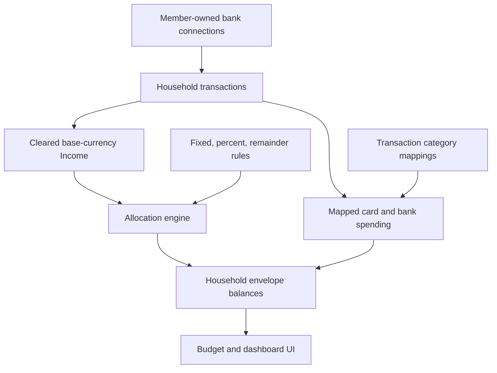

# feat: Add income-driven household envelope budgeting

## Overview

Add a production-safe envelope layer to Wollie's existing shared household workspace. The feature funds named household envelopes from each month's cleared, base-currency income; supports fixed, percentage, and remainder rules; and deducts mapped card or bank spending from the right envelope. It replaces the current manual-only category-limit screen without moving money or weakening bank-credential ownership.

## Problem Frame

The current household model correctly aggregates accounts and transactions from separate member-owned connections, but its budget is a list of manually entered monthly category limits. It cannot express "fund Pension with a fixed amount, Tax with a fixed amount, and Extra with the remainder of our combined income," nor can it make a named Food envelope automatically reflect spending across both cards. The required solution must separate transaction categorization from virtual envelopes, because friendly household buckets such as Pension, Tax, and Extra do not always correspond to a bank-provider category.

## Requirements Trace

- R1. A shared `BudgetWorkspace` combines eligible income from all member accounts into one household income pool.
- R2. An envelope supports one of: fixed monthly amount, percentage of household income, or a single everything-left remainder rule.
- R3. Rules are evaluated in a deterministic priority order using integer minor units; insufficient income produces an explicit funding gap.
- R4. An envelope can map one or more transaction categories, and debit- and credit-card spending from either member reduces its available amount.
- R5. Pending spending is reserved and visible; only cleared Income transactions fund envelopes; transfers do not count as income.
- R6. Default household setup offers Pension, Savings, Tax, Rent, Food, Travel, and Extra without imposing those values on existing users.
- R7. Users can safely edit rules, priorities, bucket type, and category mappings from the Budget screen.
- R8. Existing manual allocations survive as fixed allocation rules and legacy views remain usable during rollout.
- R9. Finance data stays authorized per household, mutations retain same-origin CSRF protection, private finance responses are not shared-cacheable, provider credentials remain owner-scoped, and no sensitive bank data enters logs.
- R10. The household owner can choose the workspace's explicit three-letter base currency; non-base-currency income and spending are excluded from automatic totals and clearly surfaced rather than silently converted.

## Scope Boundaries

- This is virtual envelope budgeting only; it does not create bank transfers, card controls, payment initiation, or pension/tax filing.
- The workspace currency remains the sole automatic-allocation currency; FX conversion and cross-currency budgets are deferred.
- Carry-forward, historical month locking, split transactions, and bulk transaction-category management are future work. Envelope setup can create a household-specific category (for example, Tax) when a mapping needs one.
- This release does not change live Enable Banking consent or connection flows.

## Context & Research

### Relevant Code and Patterns

- `prisma/schema.prisma` already provides the household workspace, member ownership, transaction category, transaction, month, and legacy allocation relations.
- `src/server/household-access.server.ts` is the required server-side authorization boundary for every private finance operation.
- `src/server/finance.ts` is the finance read/mutation façade; it currently derives category spend and persists manual monthly allocations.
- `src/server/bank-sync.ts` and `src/server/enable-banking-sync.ts` normalize bank data and preserve transaction idempotency. Their category serializers must not collapse a mapped custom category into Shopping.
- `src/lib/budget-engine.ts` and `src/lib/finance-demo.ts` contain the existing pure budget calculation and demo state patterns.
- `src/routes/app/budgets.tsx` is the current manual limit interface. `src/routes/app/index.tsx` already renders household aggregate and personal member views.

### Institutional Learnings

- `docs/plans/2026-07-15-001-feat-shared-household-finances-plan.md` establishes that both members may manage shared budgets while only each connection owner may manipulate their credentials.
- `docs/plans/2026-07-17-category-intelligence-roadmap.md` confirms that provider categories and user-defined budget meanings are distinct concerns; this plan uses an explicit mapping rather than assuming bank descriptions are enough.

### External References

- [Prisma Migrate](https://docs.prisma.io/docs/orm/prisma-migrate) supports reviewed SQL migration history and custom SQL for data migration; use it for an expand-and-backfill migration.
- [TanStack Start server functions](https://tanstack.com/start/latest/docs/framework/react/guide/server-functions) require validation and authentication inside handlers, because route guards are not private-data boundaries.
- [OWASP logging guidance](https://cheatsheetseries.owasp.org/cheatsheets/Logging_Cheat_Sheet.html) identifies bank/payment data, tokens, and connection strings as data to exclude or sanitize from logs.

## Key Technical Decisions

- **Model envelopes separately from transaction categories.** `BudgetBucket` is a named virtual envelope and `BudgetBucketCategory` maps existing transaction categories into one bucket. This allows Food to collect Groceries/Card purchases while Pension, Tax, and Extra remain meaningful virtual allocations.
- **Keep allocation rules declarative and calculate month funding from the live transaction ledger.** `BudgetAllocationRule` stores mode, value, group, and priority. The pure engine recalculates current-month funding from cleared Income transactions so a late income sync immediately updates the plan without double-applying state.
- **Use base-currency minor units.** The engine accepts integer minor units and only aggregates transactions matching `BudgetWorkspace.currency`; no foreign amount is silently added to a household budget.
- **Prioritize income protection over optimistic availability.** Fixed and percentage rules are capped by remaining confirmed income. Remainder receives the balance. Pending outflows reserve an envelope, but pending inflows never fund one.
- **Maintain backward compatibility.** Migration backfills one fixed bucket/rule for each latest legacy allocation, and the reader falls back to legacy allocations for any workspace not yet using envelopes.
- **Preserve current authorization.** All reads and writes resolve the active household with `requireFinanceHousehold`; neither the client nor a partner can select another workspace or bank connection.
- **Harden the existing server-function boundary before exposing plan mutations.** `src/start.ts` has custom request middleware, so it must explicitly include TanStack Start's CSRF middleware. Finance loaders and mutations must send private/no-store responses rather than relying on a shared-cache default.

## Open Questions

### Resolved During Planning

- **How does a credit card affect Food?** All negative mapped transactions, from any account type, count toward bucket spend. A card's credit limit is irrelevant to the virtual envelope balance.
- **Does Wollie move money to Pension, Savings, or Tax?** No. The app reserves virtual amounts and can later track an actual transfer as a transaction; it does not initiate one.
- **What happens if income is short?** Higher-priority rules fund first, the remainder gets zero, and every underfunded rule shows its shortfall.

### Deferred to Implementation

- Exact migration SQL backfill query for workspaces that have multiple historical manual budget months; select the newest `BudgetMonth.month` for each workspace/category and review the generated SQL before applying.
- Exact UI component decomposition after reading the existing budget route; preserve the established Tailwind visual language rather than introducing a new design system.

## High-Level Technical Design

> This illustrates the intended approach and is directional guidance for review, not implementation specification. The implementing agent should treat it as context, not code to reproduce.

## Implementation Units

- [x] **Unit 1: Add envelope and allocation-rule persistence with a safe backfill**

**Goal:** Introduce durable household envelope data without discarding existing category limits.

**Requirements:** R2, R3, R4, R8, R9

**Dependencies:** None

**Files:**
- Modify: `prisma/schema.prisma`
- Create: `prisma/migrations/20260826120000_income_envelope_budgeting/migration.sql`
- Create: `src/lib/income-allocation-engine.ts`
- Test: `src/lib/income-allocation-engine.test.ts`

**Approach:**
- Add `BudgetBucket`, `BudgetBucketCategory`, and `BudgetAllocationRule` relations to the workspace and transaction category models. Store allocation mode (`FIXED`, `PERCENT_OF_INCOME`, `REMAINDER`), display group (`FIXED`, `FLEXIBLE`, `FUTURE`), priority, and integer minor/basis-point values. Use cascading foreign keys only within the owning workspace so deleting a bucket cannot orphan a mapping or rule.
- Use database constraints and application validation: non-negative fixed amounts, valid percentages, one mapping per transaction category, one rule per bucket, and at most one remainder bucket per workspace. Category IDs presented by a client must be re-resolved inside the active workspace before they can create a mapping.
- Backfill the newest calendar-month legacy allocation for each workspace/category into named buckets with equivalent fixed rules and direct category mappings. Leave legacy monthly allocations intact for rollback/read compatibility.
- Keep all money calculation functions pure and integer-based; they receive eligible income and mapped spending rather than a database client.

**Execution note:** Start with failing pure-engine and constraint-shape tests before changing persistence.

**Patterns to follow:**
- `prisma/migrations/20260715120000_shared_household_finances/migration.sql` for non-destructive backfill conventions.
- `src/lib/household-finance.ts` for deterministic minor-unit/basis-point calculations and validation.

**Test scenarios:**
- Happy path: fixed rules, a percentage rule, and one remainder rule allocate a combined income total exactly once in priority order.
- Edge case: a €0 income month funds nothing; a percentage uses correct minor-unit rounding; a remainder gets all unallocated cents.
- Error path: duplicate category mappings, invalid values, duplicate names, multiple remainder rules, and a rule that exceeds supported integer range are rejected.
- Shortfall: lower-priority fixed and percentage rules report requested, funded, and unfunded amounts when confirmed income is insufficient.
- Migration: legacy latest monthly allocations create equivalent fixed buckets/rules/mappings without deleting existing `BudgetAllocation` rows.

**Verification:** Prisma validates and generates clients; the migration has reviewable, non-destructive SQL; engine tests prove cent-accurate allocation and shortfall behavior.

- [x] **Unit 2: Build the authenticated household funding and spending projection**

**Goal:** Produce one current-month household envelope projection from all eligible member transactions and expose it to existing finance loaders.

**Requirements:** R1, R3, R4, R5, R8, R10

**Dependencies:** Unit 1

**Files:**
- Create: `src/server/income-envelope-budget.server.ts`
- Modify: `src/server/finance.ts`
- Modify: `src/start.ts`
- Modify: `src/server/bank-sync.ts`
- Modify: `src/server/enable-banking-sync.ts`
- Modify: `src/lib/finance-demo.ts`
- Test: `src/lib/income-allocation-engine.test.ts`
- Test: `src/server/bank-sync.test.ts`

**Approach:**
- Query only the active household workspace and load its base-currency transactions, bucket mappings, and rules. Sum positive, cleared, Income-category transactions; exclude transfers and every other currency from the funding pool. Return the persisted workspace currency as the plan currency rather than inferring it from an arbitrary account.
- Aggregate negative transactions from every household account into their mapped bucket, retain a separate pending-spend amount, and expose unmapped spending as an explicit attention value.
- Return a serializable projection with household income, eligible/unmapped counts, requested/funded/shortfall/available bucket values, category mapping details, and the existing budget-plan shape required by the dashboard.
- Preserve manual budget data as a fallback until a workspace has its first allocation rule. Update provider serialization to preserve existing stored category names rather than coercing custom/mapped names to Shopping.
- Add explicit `no-store`/private response headers to authenticated finance loaders and configure TanStack Start CSRF middleware in `src/start.ts`, because the project already defines custom request middleware.

**Patterns to follow:**
- `src/server/finance.ts` for handler-level `requireFinanceHousehold` authorization and serializable finance data.
- `src/server/bank-sync.ts` / `src/server/enable-banking-sync.ts` for normalized, idempotent persisted transactions.

**Test scenarios:**
- Integration: eligible income from two separate member connections becomes one household funding total.
- Integration: a Food mapping deducts Grocery spending from a credit card and bank account in the same workspace.
- Edge case: a pending card purchase reserves Food but a pending salary does not fund any bucket.
- Edge case: USD data in an EUR workspace is visible as excluded but does not affect euro allocation totals.
- Error path: no rules uses legacy manual allocation; no remainder exposes unallocated income; no mapping exposes unassigned spend.
- Provider regression: an existing non-built-in stored category returns unchanged in persisted transaction data.
- Security: a cross-origin finance mutation is rejected by CSRF middleware and an authenticated finance response is not marked public-cacheable.

**Verification:** Dashboard and budget loaders return identical projection inputs for the same household; no cross-workspace or cross-currency transaction can alter the household plan.

- [x] **Unit 3: Add validated rule and mapping mutations plus a household starter template**

**Goal:** Let authorized household members save a complete, coherent allocation plan in one transaction.

**Requirements:** R2, R6, R7, R9

**Dependencies:** Units 1–2

**Files:**
- Modify: `src/server/finance.ts`
- Modify: `src/server/income-envelope-budget.server.ts`
- Modify: `src/lib/finance-demo.ts`
- Test: `src/lib/income-allocation-engine.test.ts`
- Test: `src/server/income-envelope-budget.server.test.ts`

**Approach:**
- Replace the one-category-at-a-time manual allocation mutation with a validated full-plan save. Validate names, rules, percentages, priorities, display groups, and category-to-bucket uniqueness before a single database transaction writes them.
- Let only the household owner change the workspace's ISO 4217 base currency. Changing it never converts historical amounts; it explicitly recalculates the projection from transactions in the newly selected currency.
- Include a client-safe suggested household template: Pension, Savings, Tax, Rent, Food, Travel, and Extra. It is only a form starting point; it never writes the example amounts automatically.
- Map template categories conservatively (for example, Housing to Rent, Groceries to Food, Transport to Travel, Shopping to Extra) and leave savings/tax/pension unmapped until the household chooses how to track actual transfers.
- Mirror the behavior for the development demo state so the local app visibly proves the flow without a bank connection.

**Patterns to follow:**
- `updateFinanceTransactionCategory` and `updateFinanceRecurringPayment` in `src/server/finance.ts` for server function validation and scoped upserts.
- `requireFinanceHousehold` in `src/server/household-access.server.ts` for access control.

**Test scenarios:**
- Happy path: a member saves fixed, percentage, and remainder envelopes and gets a recomputed projection.
- Permission: both household members can manage their shared plan; a non-member cannot read or mutate it.
- Permission: only the household owner can change the base currency; a member can still save envelope rules and mappings.
- Error path: client-supplied workspace IDs are ignored; duplicate mapping/category names and invalid rule modes fail without partial writes.
- Template: applying the starter template fills editable form state only and has no side effect until Save.
- Development: editing the demo plan changes Food/Extra availability after a manual demo card charge.

**Verification:** Every private mutation authenticates in its handler, persists atomically, and returns no credential, token, or raw bank-account details.

- [x] **Unit 4: Replace manual limits with a responsive envelope-budget workspace**

**Goal:** Make the funding state and card-spend relationship obvious enough for daily household use.

**Requirements:** R2, R3, R4, R5, R6, R7, R10

**Dependencies:** Units 2–3

**Files:**
- Modify: `src/routes/app/budgets.tsx`
- Modify: `src/components/finance/BudgetMeter.tsx`
- Create or modify: `src/components/finance/IncomeEnvelopeEditor.tsx`
- Create or modify: `src/components/finance/EnvelopeSummary.tsx`
- Create: `src/routes/app/budgets.test.tsx`

**Approach:**
- Show the allocation model first: cleared income, allocated/reserved amount, unallocated income, and any funding gap. State plainly that envelopes are virtual and do not transfer funds between banks.
- Let the owner choose the base currency from known account currencies (plus the current value), with a plain warning that Wollie will not convert other currencies.
- Render each envelope with its rule, requested/funded amount, card/bank spending, pending spending, available amount, and mapped transaction categories. Make over-budget and underfunded conditions prominent but calm.
- Provide add/remove/edit controls, ordered priorities, rule-type selection, amount/percentage inputs, group selection, and category mapping controls. On narrow screens these become stacked labelled controls with 44px actions.
- Offer the household starter template as an editable action, then require an explicit Save for persistence.

**Patterns to follow:**
- `src/routes/app/budgets.tsx` for the existing route and save/invalidate pattern.
- `src/routes/app/household.tsx` and `src/components/finance/BudgetMeter.tsx` for responsive, neutral finance UI and status treatment.

**Test scenarios:**
- Happy path: a user can set Food to a fixed amount, map Groceries, save, and see Food available fall after imported spending.
- Happy path: a percentage Savings rule and Extra remainder rule show the correct funding amounts for combined household income.
- Edge case: short income and unmapped spending are visible without a misleading safe-to-spend number.
- Edge case: changing the base currency recalculates from only that currency and shows the excluded amounts rather than converting them.
- Accessibility: all fields have labels, validation errors use alert semantics, keyboard navigation works, and rule changes announce save/failure status.
- Responsive: the editor remains usable without horizontal scrolling at 375px and uses denser rows on larger screens.

**Verification:** The Budget route explains both rule funding and spend tracking without requiring users to understand a credit-card limit.

- [x] **Unit 5: Surface envelope availability in the dashboard and transaction workflow**

**Goal:** Make the daily answer—"can we still spend Food/Travel money?"—available outside the editor.

**Requirements:** R4, R5, R7, R10

**Dependencies:** Units 2–4

**Files:**
- Modify: `src/routes/app/index.tsx`
- Modify: `src/routes/app/transactions.tsx`
- Modify: `src/lib/finance-demo.ts`
- Test: `src/lib/finance-demo.test.ts`
- Create: `src/routes/app/index.test.tsx`
- Create: `src/routes/app/transactions.test.tsx`

**Approach:**
- Drive the existing safe-to-spend and priority-category dashboard cards from the shared envelope projection. Separate flexible available money from protected Tax/Pension/Savings envelopes and explain the distinction.
- Link the highest-risk envelope and unmapped-spend state to filtered Activity, where the user can confirm the transaction category that feeds its mapped bucket.
- Retain the household/member view selector. Household availability is authoritative; personal views continue using the existing account and cost-share scaling rules.

**Patterns to follow:**
- `src/routes/app/index.tsx` for household view switching and safe-to-spend explanation.
- `src/routes/app/transactions.tsx` for category corrections and router invalidation.

**Test scenarios:**
- Integration: Food, Travel, and Extra availability updates after categorizing a card transaction from Activity.
- Edge case: protected Future/Fixed envelopes are not included in flexible safe-to-spend, even when they have available funds.
- Integration: switching from household to a member view does not expose an account or connection credential belonging to the other member.
- Regression: no-envelope household continues to render the existing account and manual-plan paths.

**Verification:** A household can answer its remaining Food/Travel/Extra capacity from the dashboard and trace each value back to income, rules, and transactions.

## System-Wide Impact

- **Interaction graph:** session -> household membership guard -> finance/server projection -> pure allocation engine -> budget/dashboard/transactions UI. Bank sync persists category labels; those labels pass through a bucket mapping before affecting availability.
- **Error propagation:** invalid plan saves return user-safe validation messages; provider failures retain the last stored ledger; insufficient income is a valid projection state, not an exception.
- **State lifecycle risks:** migration backfill must never delete legacy allocations; full-plan saves must not partially delete valid rules; rule recalculation must not double-count a transaction; category mapping deletion must leave spend explicitly unmapped.
- **API surface parity:** dashboard, Budget, Activity, and personal/household views must consume the same current-month projection. New server functions remain authenticated in their handlers, rely on explicit same-origin CSRF middleware, and are returned with private/no-store cache behavior.
- **Integration coverage:** two member accounts + one card spend + one mapping + one rule set; pending income/spend; sync persistence preserving category labels; legacy workspace fallback.
- **Unchanged invariants:** provider token encryption, connection-owner-only credential mutations, transaction uniqueness, active household authorization, and no automatic payment initiation.

## Risks & Dependencies

| Risk | Mitigation |
|---|---|
| A migration changes existing budgets unexpectedly | Expand with new tables, retain legacy allocations, backfill equivalent fixed rules, inspect SQL, and verify counts before enabling new UI. |
| Pending or transfer transactions falsely fund spending | Fund only cleared Income-category records; recognize transfer labels before positive-income inference; test both cases. |
| Cross-currency totals mislead a shared household | Use workspace currency only for automatic allocation and display excluded values rather than inventing FX. |
| Card spending bypasses an envelope | Map transaction categories to buckets and aggregate every account type; display unmapped spend as attention. |
| Partner can see bank secrets or change another's connection | Reuse membership authorization for plans and leave connection mutation user-scoped. |
| Plan configuration is ambiguous or overfunded | Deterministic priorities, one remainder, shortfall indicators, integer minor-unit arithmetic, and atomic validation. |

## Documentation / Operational Notes

- Update the in-app Budget copy to state that Wollie does not move money or enforce card limits.
- During rollout, monitor migration application, allocation-validation failures, plan-save errors, excluded-currency counts, and unmapped-spend rates. Log only workspace-safe identifiers and aggregate counts—never tokens, account numbers, descriptions, or raw balances.
- Roll back application code before removing any legacy allocation data; this migration is additive and preserves the previous read path.

## Sources & References

- **Origin document:** `docs/brainstorms/2026-08-26-income-envelope-budgeting-requirements.md`
- Existing household plan: `docs/plans/2026-07-15-001-feat-shared-household-finances-plan.md`
- Existing finance plan: `docs/plans/2026-07-13-bank-sync-budgeting-app-plan.md`
- Related code: `prisma/schema.prisma`, `src/server/finance.ts`, `src/server/bank-sync.ts`, `src/routes/app/budgets.tsx`
- External docs: [Prisma Migrate](https://docs.prisma.io/docs/orm/prisma-migrate), [TanStack Start server functions](https://tanstack.com/start/latest/docs/framework/react/guide/server-functions), [OWASP Logging Cheat Sheet](https://cheatsheetseries.owasp.org/cheatsheets/Logging_Cheat_Sheet.html)
